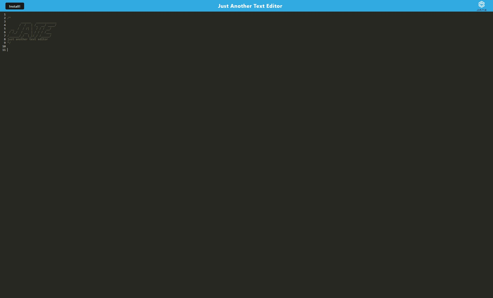

# Text Editor

## Description 
This is a simple text editor application that can be ran without network connectivity. 

## Table of Contents
- [Installation](#installation)
- [Usage](#usage)
- [URL](#url)
- [Credits](#credits)
- [License](#license)
- [How to Contribute](#how-to-contribute)
- [Questions](#questions)

## Installation
From the root of the folder, run these commands: npm run install | npm run build | npm run start

## Usage
Open in a browser and go to http://localhost:3000/ Here you can type into the text editor.

## URL
https://text-editor-3i5d.onrender.com/

## Credits
Bryan Taboada

## License

This project is licensed under the MIT 
- see the following link for details: [MIT License](https://opensource.org/licenses/MIT)

## How to Contribute
- Fork the repository to your own GitHub account.
- Clone the repository to your local machine.
- Create a new branch for your feature or bug fix.
- Commit your changes and ensure that the commit message is clear and descriptive:
- Push to your branch.
- Create a Pull Request from your branch into the main repository's main branch. Make sure to provide a detailed explanation of the changes you've made.

## Questions
My github profile is: https://github.com/Taboada-B

My email is: b.taboada123@gmail.com
